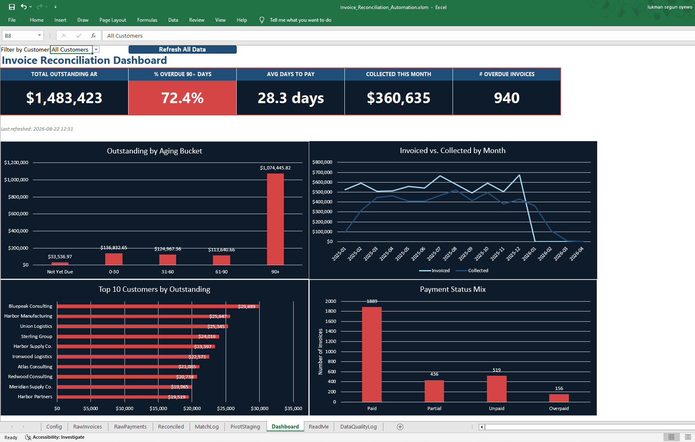
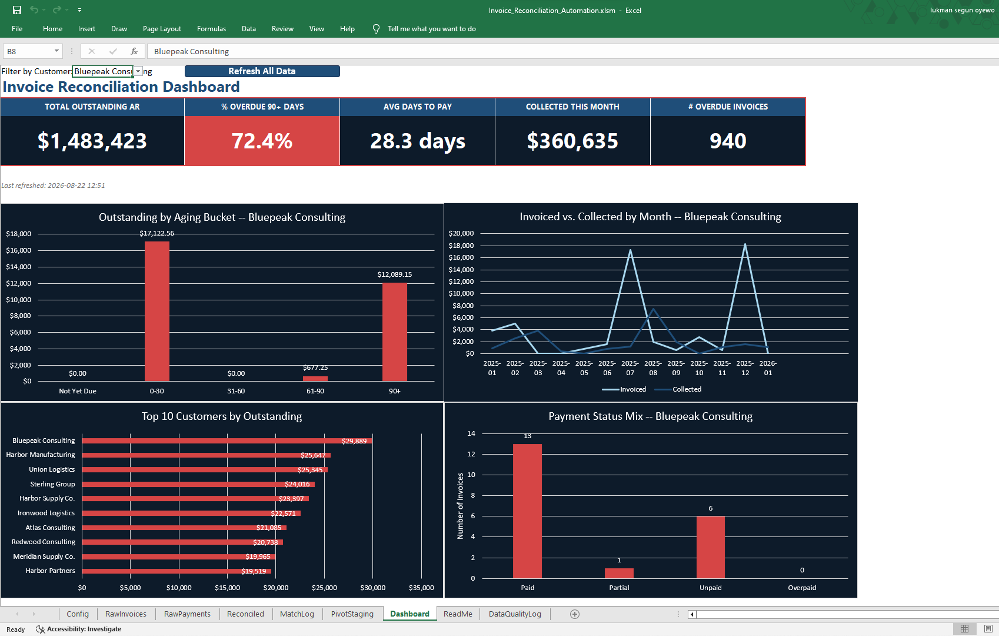
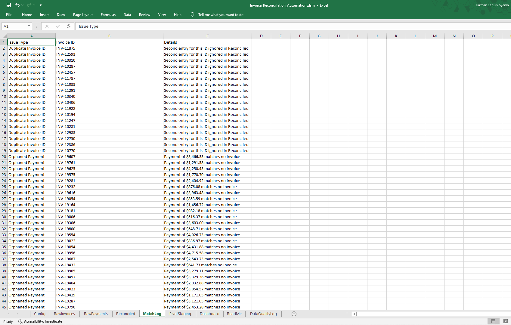
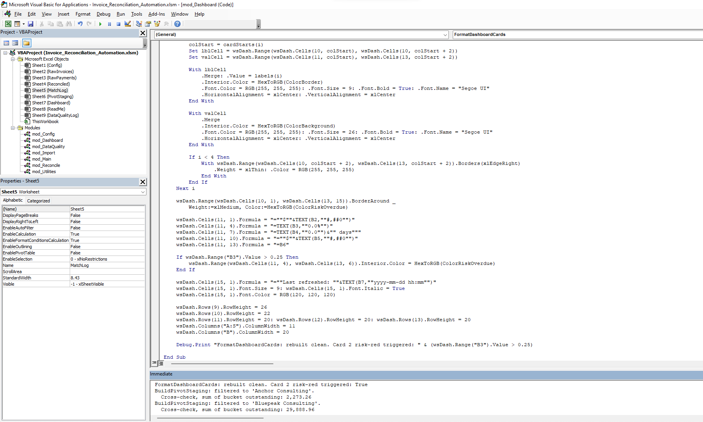

# Invoice Reconciliation & AR Aging Automation

> A VBA-automated Excel system that reconciles invoices against payments, flags anomalies, and refreshes a full KPI dashboard in one click — built to replace hours of manual spreadsheet reconciliation with a system that proves its own numbers are correct.



## Table of Contents
- [Business Problem](#business-problem)
- [Business Value](#business-value)
- [Tech Stack](#tech-stack)
- [Architecture](#architecture)
- [The Dataset](#the-dataset)
- [Key Features](#key-features)
- [Sample Output](#sample-output)
- [Screenshots](#screenshots)
- [How to Run It](#how-to-run-it)
- [Engineering Decisions & Real Bugs Fixed](#engineering-decisions--real-bugs-fixed)
- [Future Enhancements](#future-enhancements)
- [About](#about)

---

## Business Problem

Most businesses track invoices in one file and payments in another — often exported from different systems entirely. Every billing cycle, someone manually cross-references the two with VLOOKUP or by eye to figure out which invoices are unpaid, which are overdue, and how overdue. It's slow, it breaks silently the moment someone fat-fingers an Invoice ID, and by the time anyone notices a customer is 90 days late, the spreadsheet is already stale.

This system replaces that manual process with a one-click pipeline: import both files, match them, flag anything that doesn't line up, and refresh a live dashboard — in roughly the time it takes to click a button.

## Business Value

- **Time**: a manual reconciliation that takes 2–4 hours becomes a ~2-minute automated refresh.
- **Cash flow visibility**: total outstanding AR and aging breakdown available instantly, not once a month.
- **Error reduction**: Dictionary-based matching doesn't miss rows the way manual VLOOKUP-dragging does.
- **Faster collections**: a standing "90+ days overdue" list means action happens immediately instead of after someone goes looking for it.

Manual AP/AR processing has been benchmarked at roughly **$15–25 per invoice**, versus under $5 once automated — and commercial reconciliation software runs **$40,000–80,000/year at mid-market scale**. This system sits in the gap between "by hand forever" and "priced for a company with a finance department."

## Tech Stack

- **Excel VBA** — the entire matching, data-quality, and dashboard-refresh engine
- **Python (pandas)** — synthetic dataset generation, and independent verification of every KPI before it was ever calculated in VBA
- **Excel native charting** — 4 charts, hand-built and styled rather than generated via fragile VBA chart-object code

## Architecture

### Data flow
```
invoices_raw.csv ─┐
                   ├──▶ mod_Import ──▶ RawInvoices / RawPayments
payments_raw.csv ─┘
                            │
                            ▼
                    mod_Reconcile ──▶ Reconciled + MatchLog
                            │
                            ▼
                   mod_DataQuality ──▶ DataQualityLog
                            │
                            ▼
                    mod_Dashboard ──▶ Dashboard (KPIs) + PivotStaging (chart data)
                            │
                            ▼
                     4 styled charts + customer filter
```

### Workbook structure

| Sheet | Purpose |
|---|---|
| Config | All tunable settings — aging thresholds, file paths, color palette, reporting date |
| RawInvoices | Unedited imported invoice data |
| RawPayments | Unedited imported payment data |
| Reconciled | One row per unique invoice — matched status, outstanding balance, aging bucket |
| MatchLog | Flagged anomalies: duplicate Invoice IDs, orphaned payments |
| DataQualityLog | Flagged data-integrity issues, independent of matching |
| PivotStaging | Computed summary tables feeding the 4 dashboard charts |
| Dashboard | KPI cards, charts, customer filter, refresh button |
| ReadMe | In-workbook sheet-by-sheet guide (separate from this file) |

### VBA modules

| Module | Responsibility | Key Procedures |
|---|---|---|
| `mod_Config` | Loads every workbook setting into public variables | `LoadConfig` |
| `mod_Utilities` | Reusable helpers shared by every other module | `SheetExists`, `GetOrCreateSheet`, `ClearBelowHeader`, `ParseFlexibleDate`, `HexToRGB` |
| `mod_Import` | Reads both raw CSVs, encoding-safe regardless of source OS | `ImportInvoices`, `ImportPayments`, `ImportAll` |
| `mod_Reconcile` | Three-pass Dictionary-based matching engine | `ReconcileInvoices` |
| `mod_DataQuality` | Scans raw data for structural issues, independent of matching | `CheckDataQuality` |
| `mod_Dashboard` | KPI math, chart-data aggregation, card styling, chart-title sync | `RefreshDashboard`, `BuildPivotStaging`, `UpdateChartTitles`, `FormatDashboardCards` |
| `mod_Main` | Single entry point — wires every step into one button | `RunFullRefresh` |
| `Dashboard` (sheet code) | Auto-triggers a filtered rebuild when the customer dropdown changes | `Worksheet_Change` |

**Why VBA-computed summary tables instead of native Excel PivotTables?** Every number in this system needed to be provable against an independently-calculated target before it shipped — see [Sample Output](#sample-output) below. That's straightforward with code and much harder to pin down with click-driven Pivot Tables.

## The Dataset

Synthetic, reproducible, and deliberately messy — `data/generate_dataset.py` builds `invoices_raw.csv` (3,018 rows: 3,000 unique + 18 injected duplicates) and `payments_raw.csv` (3,368 rows), seeded so re-running it produces byte-identical output.

Injected on purpose, not incidental:

| Issue | Count | Why it's there |
|---|---|---|
| Duplicate Invoice ID | 18 | Tests whether the matching logic double-counts |
| Orphaned payment (matches no invoice) | 66 | Tests whether anomalies get logged instead of silently dropped |
| Blank Customer Name / Region | 30 / 45 | Tests grouping logic against missing data |
| Invoice ID with stray whitespace | 45 | Tests whether exact-match lookups fail without a `Trim()` |
| Payment Date in `MM/DD/YYYY` instead of `YYYY-MM-DD` | 380 | Tests date parsing against a real cross-format mismatch |

## Key Features

- **One-click full refresh** — `RunFullRefresh` runs Import → Reconcile → Data Quality → Dashboard → PivotStaging → card formatting, in the only order that's actually valid, and resets the view to company-wide on completion.
- **Customer filter, fully interactive** — pick a name from the Dashboard dropdown and three of the four charts (plus the aging/status breakdowns) rescope automatically; the Top 10 Customers ranking deliberately stays company-wide, since a "top 10" scoped to one customer means nothing.
- **Conditional risk signaling** — the "% Overdue 90+" card turns red automatically once that figure crosses 25%, using the same red as every other risk signal in the workbook, not an arbitrary new color.
- **Self-verifying data quality and match logs** — every anomaly the synthetic dataset was built to contain gets caught and logged with a plain-English reason, not just flagged with no explanation.

## Sample Output

Numbers below are the actual output of `RunFullRefresh` against the included dataset, each cross-checked against an independent Python calculation before being trusted.

| Metric | Value |
|---|---|
| Total Outstanding AR | $1,483,423.46 |
| % Overdue 90+ Days | 72.4% |
| Avg Days to Pay | 28.3 |
| Collected This Month | $360,634.61 |
| # Overdue Invoices | 940 |
| Reconciliation anomalies (MatchLog) | 84 (18 duplicates, 66 orphaned payments) |
| Data quality issues (DataQualityLog) | 120 |

Worth noting: 72.4% of outstanding balance sitting in the 90+ bucket is a real, non-obvious signal this system surfaced on its own — not a stat picked to look dramatic. It reflects a full year of invoice dates viewed from a single fixed reporting snapshot, and it's exactly the kind of pattern a collections team would want flagged immediately.

## Screenshots

| | |
|---|---|
|  |  |
| Full dashboard — company-wide view | Filtered to a single customer. Cards and Top 10 stay global on purpose; the other three charts rescope automatically |
|  |  |
| Real flagged anomalies from an actual run, not a mockup | All 7 modules, each independently tested before the pipeline was ever wired together |

## How to Run It

1. Clone this repo.
2. Place `invoices_raw.csv` and `payments_raw.csv` (in `data/raw/`, or regenerate them with `python generate_dataset.py`) somewhere accessible, and update the `Raw Data Folder Path` cell on the **Config** sheet to match.
3. Open `Invoice_Reconciliation_System.xlsm` in Excel on Windows. Enable macros when prompted.
4. Click **Refresh All Data** on the Dashboard tab, or run `RunFullRefresh` from the VBA Immediate window.
5. Use the **Filter by Customer** dropdown to drill into any single account.

## Engineering Decisions & Real Bugs Fixed

These are documented deliberately, not cleaned up out of the history — a system that never broke during development either wasn't tested hard enough or isn't being honest about it.

**Silent import failure from cross-platform line endings.** The synthetic CSVs were generated on a Linux system, which writes plain `\n` line endings. VBA's classic `Line Input` statement only recognizes `\r` or `\r\n` — so it read the *entire* file as one giant first line, wrote a garbled row, then immediately hit end-of-file. No error, no crash — both import routines just silently reported "0 data rows imported." Verified the actual byte content to confirm the cause, then rewrote the import logic to read the whole file as one block and normalize any line-ending style before splitting — now correct regardless of which OS produced the source file.

**Orphaned payments leaking into revenue totals.** Early versions of the "Collected" calculations summed every payment row with a valid date, without checking whether its Invoice ID actually matched anything. The 66 deliberately orphaned payments in the dataset were getting counted as real collected revenue. Fixed by building a set of valid Invoice IDs from the Reconciled sheet first, and only counting a payment toward any total if its ID is a member of that set.

**A working Sub silently deleted mid-edit, caught only by full end-to-end testing.** While rewriting `BuildPivotStaging` for the customer-filter feature, a "select from here to `End Sub`" edit ran slightly long and swallowed the entirety of `FormatDashboardCards`, which sat directly after it in the file. Every dashboard screenshot after that still looked correct — because deleting code doesn't undo formatting it already applied to cells. The break was only discovered when `mod_Main` tried to call a Sub that no longer existed. The lesson: testing each module in isolation proves that module works, not that the whole chain still does — full pipeline runs matter even after everything individually passed.

**Making the dashboard-card rebuild idempotent.** Restructuring the KPI cards to a tighter layout triggered Excel's "merging cells only keeps the upper-left value" warning, because the new merge ranges partially overlapped the old ones — a dialog that would silently stall `RunFullRefresh` if it ever appeared mid-automated-run. Fixed by having the Sub unmerge and fully clear its own working area before rebuilding every time, so it produces the same correct result no matter what state it finds — proven by running it twice back-to-back with identical output and zero warnings.

## Future Enhancements

- **Native cross-filtering slicers.** The current filter is a VBA-driven dropdown by design — true Excel slicers need a shared PivotTable to filter multiple charts from one click, which would mean rebuilding the chart layer on a different foundation. Documented here rather than force-fit, since a slicer that only filters one disconnected chart would be worse than no slicer at all.
- **Additional reconciliation variants on the same core engine.** The matching logic (`Dictionary`-based, two tables, one key, flag mismatches) barely changes across use cases — only the column mapping and Config values do. Bank reconciliation, 3-way PO/invoice/receipt matching, payroll reconciliation, and expense/credit-card reconciliation are all realistic extensions of this same architecture, not separate builds from scratch.
- **Automated PDF/email reporting** of the aging summary on a schedule, for teams who want the numbers pushed to them rather than pulled.

## About

Built by **Oyewo Lukman Segun** — Aeronautical Engineering background, transitioning into data analytics with a focus on business process automation.

- GitHub: [Luking007](https://github.com/Luking007)
- LinkedIn: [oyewo-lukman](https://linkedin.com/in/oyewo-lukman-8969761aa)
- Freelance: LukingAutomations on Fiverr
